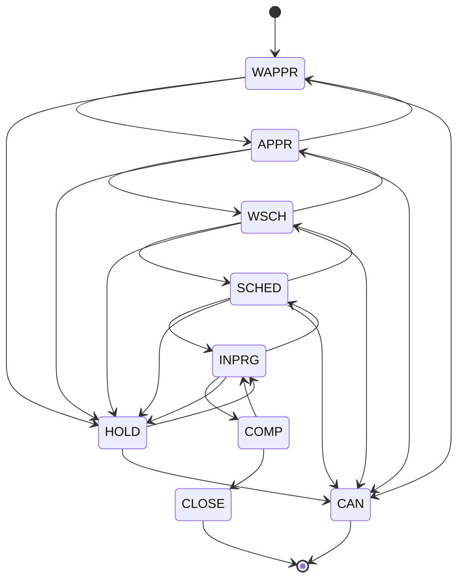

# 1. Work Order Process

**SEDER CAFM · Document 1 of 6 · prepared in response to DAB review Section A.1**

Scope: the work order lifecycle for every work type the system handles — Corrective Maintenance (CM),
Preventive Maintenance (PM) and Incident — plus the Job Request intake that feeds CM.

> Everything in this document describes the process **as the application currently enforces it**. The status
> rules and the entry conditions are generated from or transcribed against the shipped source, not drafted
> separately, so this is a description of the system rather than an aspiration for it.

---

## 1.1 The record types and how work starts

| Work type | Raised by | Trigger | Notes |
|---|---|---|---|
| **CM** | Corrective, on failure | A Job Request approved and converted, or a work order raised directly | The only type that requires full failure classification |
| **PM** | Planned, on schedule | A PM schedule reaching its next due date | Carries a Job Plan; tasks are copied to the work order |
| **Incident** | Reactive, on event | An incident record | Follows the same lifecycle as CM without the CM-only planning gates |

### Job Request → CM conversion

A Job Request is the intake channel for anyone who is not a planner. It has its own short lifecycle
(`NEW → WAPPR → RESOLVED`) and does not become work until it is reviewed:

1. **NEW** — the requester submits description, site, location and reported-by.
2. **WAPPR** — waiting for department review. The reviewer adds the routing and classification the requester
   could not be expected to know: Department, Sub Department, Assigned Department and Failure Code.
3. **RESOLVED** — on approval the system creates a CM work order and stores its number on the request, so the
   audit trail from request to work order is preserved in both directions.

The conversion is blocked until all five review fields are present. This is deliberate: a CM work order
cannot pass its own later gates without them, so the check happens at the point where someone competent to
answer is looking at the record.

---

## 1.2 The work order lifecycle

The lifecycle is **forward-only with one step back**. A single step backwards is allowed so that a misclick
can be corrected without an administrator; jumping several stages backwards is not, because it would
invalidate the completion data already captured.

Three rules govern the diagram:

- **HOLD** is reachable from any active status and returns to the status it was held from — not to the front
  of the chain. A job paused at INPRG resumes at INPRG.
- **CAN** (cancel) is only available **before work starts**. Once a job reaches INPRG it must be completed or
  held; cancelling it would discard labour already booked against it.
- **CLOSE** is terminal. There is no transition out of a closed work order.

<!-- generated:wo-transitions -->

| Status | Meaning | May move to | Notes |
| --- | --- | --- | --- |
| WAPPR | Waiting for Approval | APPR, HOLD, CAN |  |
| APPR | Approved | WAPPR, WSCH, HOLD, CAN |  |
| WSCH | Waiting for Schedule | APPR, SCHED, HOLD, CAN |  |
| SCHED | Scheduled | WSCH, INPRG, HOLD, CAN |  |
| INPRG | In Progress | SCHED, COMP, HOLD |  |
| COMP | Completed | INPRG, CLOSE | Cannot be put on hold once complete |
| CLOSE | Closed | — | Terminal - no further transitions |
| CAN | Cancelled | — | Terminal - no further transitions |
| HOLD | On Hold | INPRG, CAN | Returns to the status it was held from (INPRG shown as the example) |

<!-- /generated -->

---

## 1.3 Entry conditions — what must be complete to reach each status

This is the operative part of the process. The system does not warn after the fact; it **disables the
transition** and states what is missing, so an incomplete work order cannot advance.

| Target status | Everything required |
|---|---|
| **APPR** — Approved | The ten Overview fields: Description, Site, Asset, Asset Description, Location, Department, Assigned Department, Target Start, Target Finish, and Target Finish on or after Target Start |
| **WSCH** — Waiting for Schedule | Everything for APPR, **plus** planning: labour with estimated hours; for CM also required materials and required tools. **Plus** the hold blockers cleared: any material shortage resolved or raised as a purchase requisition, and the permit-to-work file attached where one is required |
| **SCHED** — Scheduled | Same conditions as WSCH |
| **INPRG** — In Progress | Same conditions as WSCH |
| **COMP** — Completed | The failure set: for CM, Failure Code and Problem Code, plus Cause Code and Remedy Code **where the library offers them for the chosen problem** |
| **CLOSE** — Closed | Everything for COMP, **plus** actuals: technician remarks, completion notes, actual labour and hours, actual materials and actual tools |
| **HOLD** | No entry conditions — a job can always be paused |
| **CAN** | No entry conditions, but only reachable before INPRG |

Two consequences worth stating explicitly to reviewers:

- **Planning is enforced before scheduling, not before approval.** A supervisor can approve work on the
  strength of the description and target dates; the planner's detail is required only when the job is put in
  the schedule. This keeps approval fast without letting unplanned work reach a technician.
- **Cause and Remedy are conditional, not universal.** The system requires them only when the failure library
  actually offers cause or remedy options for the selected problem code. See Document 5 — at present the
  library offers none, so in practice only Failure Code and Problem Code are enforced today.

---

## 1.4 Differences by work type

| Stage | CM | PM | Incident |
|---|---|---|---|
| Creation | Manual, or converted from a Job Request | Generated from a PM schedule at its next due date | Raised from an incident record |
| Job Plan | Optional | **Attached from the schedule**, tasks copied onto the work order | Optional |
| Planned materials | **Required** before scheduling | Not required | Not required |
| Planned tools | **Required** before scheduling | Not required | Not required |
| Planned labour | Required | Required | Required |
| Failure classification | **Required** before completion | Not required | Not required |
| Actuals | Required before close | Required before close | Required before close |

The asymmetry is intentional. A PM job's materials are already described by its Job Plan, so re-entering them
would be duplicate work; a CM job has no plan and its materials must be established before a technician is
dispatched. Failure classification exists to build reliability history, which only has meaning for a failure —
hence CM only.

---

## 1.5 Supporting controls

**Permit to work.** Where a work order requires a permit, the PTW file must be attached before the job can be
scheduled or started. This appears as a hold blocker rather than a separate status.

**Material availability.** If planned materials exceed available stock, the work order is blocked from
scheduling until either the shortage is resolved from another store or a purchase requisition is raised
against it. The requisition is linked to the work order.

**SLA.** Target Start and Target Finish are mandatory from approval onwards, and a work order whose target
finish has passed while still open is reported as an SLA violation. **See Document 4** — target dates are
currently entered by hand rather than derived from priority, which is the main limitation of SLA reporting
today.

---

## 1.6 Reference — full status matrix

All statuses across every application in the system, as held in the project's status matrix.

<!-- generated:status-matrix -->

**Service Request**

| Status | Description | Typical usage |
| --- | --- | --- |
| NEW | New request created | Initial request |
| QUEUED | Waiting for review | Before assignment |
| INPRG | In Progress | Under review |
| RESOLVED | Resolved | Issue resolved |
| CLOSED | Closed | Request closed |
| CAN | Cancelled | Cancelled |
| WAPPR | Waiting for Approval | Approval workflow |

**Work Order**

| Status | Description | Typical usage |
| --- | --- | --- |
| WAPPR | Waiting for Approval | Awaiting approval |
| APPR | Approved | Ready for execution |
| WSCH | Waiting for Schedule | Scheduling |
| SCHED | Scheduled | Planned |
| INPRG | In Progress | Execution |
| COMP | Completed | Finished |
| CLOSE | Closed | Closed |
| CAN | Cancelled | Cancelled |
| HOLD | On Hold | Paused |

**Preventive Maintenance**

| Status | Description | Typical usage |
| --- | --- | --- |
| ACTIVE | Active | Generates WO |
| INACTIVE | Inactive | Stopped |
| DRAFT | Draft | Preparation |

**Assets**

| Status | Description | Typical usage |
| --- | --- | --- |
| OPERATING | Operating | In service |
| NOT READY | Not Ready | Not commissioned |
| DECOMMISSIONED | Decommissioned | Out of service |
| RETIRED | Retired | Disposed |
| BROKEN | Broken | Needs repair |

**Location**

| Status | Description | Typical usage |
| --- | --- | --- |
| OPERATING | Operating | Active |
| PLANNED | Planned | Future |
| DECOMMISSIONED | Decommissioned | Inactive |

**Job Plan**

| Status | Description | Typical usage |
| --- | --- | --- |
| DRAFT | Draft | Preparation |
| ACTIVE | Active | Usable |
| INACTIVE | Inactive | Disabled |

**Purchase Requisition**

| Status | Description | Typical usage |
| --- | --- | --- |
| WAPPR | Waiting for Approval | Approval |
| APPR | Approved | Approved |
| CLOSE | Closed | Completed |
| CAN | Cancelled | Cancelled |

**Purchase Order**

| Status | Description | Typical usage |
| --- | --- | --- |
| WAPPR | Waiting for Approval | Approval |
| APPR | Approved | Released |
| INPRG | In Progress | Processing |
| CLOSE | Closed | Completed |
| CAN | Cancelled | Cancelled |

**Inventory Usage**

| Status | Description | Typical usage |
| --- | --- | --- |
| ENTERED | Entered | Created |
| STAGED | Staged | Prepared |
| COMPLETE | Complete | Issued |
| CANCELLED | Cancelled | Cancelled |

**Incident**

| Status | Description | Typical usage |
| --- | --- | --- |
| NEW | New | Reported |
| INPRG | In Progress | Investigating |
| RESOLVED | Resolved | Resolved |
| CLOSED | Closed | Closed |

<!-- /generated -->

---

*Generated tables in this document come from `docs/generate.mjs`. Regenerate with `node docs/generate.mjs`.*
