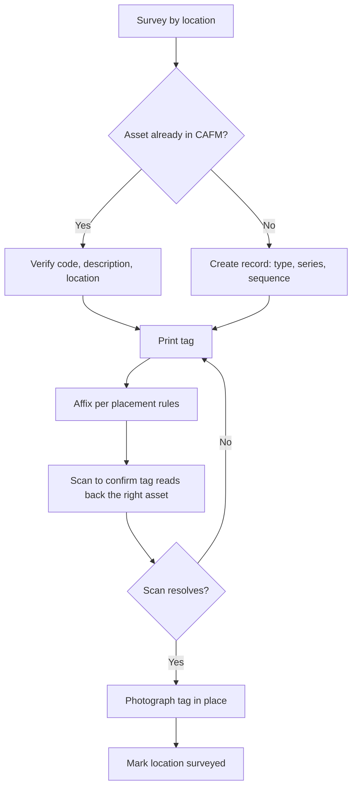

# 6. Proposed Asset Tagging Plan

**SEDER CAFM · Document 6 of 6 · prepared in response to DAB review Section A.6**

Scope: how physical assets are labelled so that the equipment in the field and the record in the CAFM system
identify each other unambiguously.

> **This document is a proposal.** The coding structure it applies (section 6.1) is the one in force and is
> documented in Document 2. The physical specification, the survey method and the rollout sequence are
> recommendations for SEDER and DAB to agree.

---

## 6.1 What goes on the tag

The tag carries the **asset number** and nothing else that can go out of date. Descriptions, owners and
locations change over the life of an asset; the number does not.

```
┌──────────────────────────────┐
│  SEDER  ·  FACILITIES        │
│                              │
│   ███ ▄▄ █ ▀█    FCU-100-0001│
│   █ ▀█▄▄▀ ███                │
│   ██▄ ▀█ ▄▄█     Fan Coil Unit│
│                              │
│  Scan to report a fault      │
└──────────────────────────────┘
```

| Element | Content | Why |
|---|---|---|
| Asset number | e.g. `FCU-100-0001` | The unique key; human-readable so it works when a scan fails |
| QR code | Encodes the asset number | Removes transcription errors, which are the main source of misattributed work orders |
| Equipment type | e.g. `Fan Coil Unit` | Lets a technician confirm they are at the right unit before scanning |
| Instruction line | "Scan to report a fault" | The tag doubles as the fault-reporting entry point for occupants |

**Child assets are tagged too.** A component carries its own full code including the parent, so
`FCU-100-0001-RGS-500-0009` appears on the grille and `FCU-100-0001` on the fan coil unit it belongs to. Any
technician can see the parent relationship from the tag alone.

### Current asset register

<!-- generated:asset-register -->

| Asset number | Description | Type | Parent | Location | Site | Status |
| --- | --- | --- | --- | --- | --- | --- |
| SSU-100-0001 | SPLIT UNIT | Split Unit | — | RC-1031-RD-001-00-054 | 1031 | OPERATING |
| WWU-100-0001 | WINDOW UNIT | Window / Wall Unit | — | RC-1031-RD-001-00-055 | 1031 | OPERATING |
| SSU-200-0001 | SPLIT UNIT | Split Unit | — | RC-1031-RD-001-00-056 | 1031 | OPERATING |
| FCU-100-0001 | FAN COIL UNIT | Fan Coil Unit | — |  | 1034 | OPERATING |
| FCU-100-0001-RGS-500-0009 | FAN COIL UNIT | Fan Coil Unit | FCU-100-0001 | RC-1034-AS-008-04-190 | 1034 | OPERATING |
| ALS-HV-00001 | SPLIT A/C UNIT | — | — | RC-1031-RD-001-00-055 | 1031 | OPERATING |
| ALS-HV-00002 | SPLIT A/C UNIT | — | — | RC-1031-RD-001-00-055 | 1031 | OPERATING |
| ALS-HV-00003 | PACKAGE A/C UNIT | — | — | RC-1031-RD-01-00-ES01 | 1031 | OPERATING |
| MS-MEC-FCU-001 | FAN COIL UNIT | — | — | RC-1034-AS-008-04-190 | 1034 | OPERATING |
| MS-MEC-SAU-001 | SPLIT A/C UNIT | — | — | RC-1031-RD-01-00-ES01 | 1031 | OPERATING |
| MS-MEC-FDA-001 | FIRE DAMPER | — | — | RC-1031-RD-001-00-055 | 1031 | OPERATING |

<!-- /generated -->

### Type and series allocation in use

<!-- generated:series-allocation -->

| Type code | Series in use | Assets |
| --- | --- | --- |
| ALS | HV | 3 |
| FCU | 100 | 2 |
| MS | MEC | 3 |
| SSU | 100 | 1 |
| SSU | 200 | 1 |
| WWU | 100 | 1 |

<!-- /generated -->

---

## 6.2 Proposed label specification

| Property | Indoor | Outdoor / plant |
|---|---|---|
| Material | Self-adhesive polyester | Anodised aluminium or engraved traffolyte |
| Size | 50 × 25 mm | 80 × 40 mm |
| Print | Thermal transfer, black on white | Laser-engraved |
| Adhesive | Permanent acrylic | Permanent acrylic + 2 rivets or screws |
| Resistance | Wipe-clean, non-solvent | UV, rain, −10 to +80 °C, washdown |
| QR | Minimum 15 × 15 mm, error correction level M | Minimum 20 × 20 mm, level Q |
| Expected life | 5 years | 10 years |

Plant rooms, roof-mounted equipment and anything within reach of cleaning chemicals take the outdoor
specification regardless of whether it is technically indoors.

---

## 6.3 Proposed placement rules

1. **Visible without tools and without moving the asset.** If reading the tag requires opening a panel, the
   tag is in the wrong place.
2. **Eye level where possible**, or on the access side where not.
3. **Never on a removable panel, cover or filter door** — these get swapped between units and the identity
   travels with them.
4. **Never on a surface above 80 °C**, on lagging, or on anything scheduled for repainting.
5. **Consistent position within an equipment type.** If split units are tagged on the lower right of the
   indoor unit, every split unit is tagged there. A technician should know where to look before arriving.
6. **Concealed assets** — anything above a ceiling or below a floor — take a second tag at the access point,
   marked with the asset number and the words "above ceiling" or equivalent.

---

## 6.4 Proposed survey and tagging workflow



**Work location by location, not asset type by asset type.** A surveyor finishes a room completely before
moving on. Working by type means visiting every room once per equipment type, and rooms get missed.

**The scan-back check in step G is not optional.** It is the only step that proves the tag on the wall and the
record in the system agree. Skipping it is how estates end up with tags that scan to the wrong asset — a
failure that is invisible until a technician does work against the wrong record.

---

## 6.5 Proposed rollout sequence

| Phase | Scope | Rationale |
|---|---|---|
| 1 | Critical services plant — HVAC, electrical distribution, pumps | Highest maintenance volume, so the earliest return |
| 2 | Royal and VIP areas | Highest consequence of a misattributed job |
| 3 | Remaining occupied areas | Bulk of the estate |
| 4 | External, landscape and service zones | Lowest work order density |
| 5 | Re-tagging of legacy-coded assets | Deferred until the coding corrections in Document 2 are agreed |

Phase 5 depends on Document 2, section 2.4. Re-tagging an asset whose code is about to change means tagging
it twice, so the coding corrections should be settled first.

---

## 6.6 Ongoing control

- **New assets are tagged at handover**, before they are accepted into service. An untagged asset is an
  incomplete handover.
- **Damaged or unreadable tags are replaced under a CM work order** against the asset itself, so the
  replacement is recorded rather than done informally.
- **The asset number never changes** once tagged. If an asset moves, its location changes and its number does
  not — this is the whole reason the number carries no location information.
- **An annual sample audit** of 5% of tags per site, verifying that each scans to the correct record and
  remains legible.

---

## 6.7 What is required to complete this deliverable

| # | Action | Owner |
|---|---|---|
| 1 | Approve the label specification and placement rules | SEDER / DAB |
| 2 | Confirm the type code list is complete for the estate (Document 2) | SEDER maintenance |
| 3 | Settle the location code corrections (Document 2, §2.4) before phase 5 | SEDER / ICT |
| 4 | Procure label stock and printers to the agreed specification | SEDER procurement |
| 5 | Run the survey per 6.4, phased per 6.5 | SEDER FM |

---

*Generated tables in this document come from `docs/generate.mjs`. Regenerate with `node docs/generate.mjs`.
Sections 6.2 to 6.6 are hand-written proposals and are not generated from system data.*
